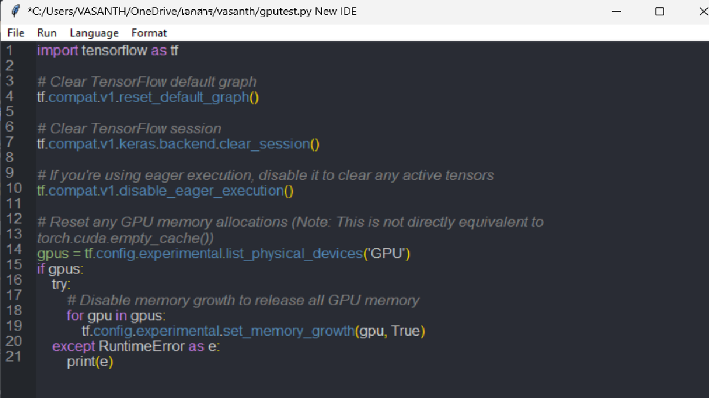

# Code-IDE-Using-Python
Creating a Python IDE for efficient coding with features like syntax highlighting, code completion, error detection, and an integrated debugger. Built using Python and Tkinter, it aims to streamline development, support project management, and enhance productivity for Python programmers, fostering innovation in Python projects.




## Features

- **Syntax Highlighting**: Highlights keywords and characters for Python, C, and Java.
- **Code Formatting**: Automatically formats C code based on indentation rules.
- **Run Code**: Execute Python, C, and Java code within the IDE.
- **File Handling**: Open, save, and save-as functionality for different language files.
- **Output Window**: Displays program output and errors, supports input during execution.

## Installation

To run this IDE on your local machine, follow these steps:

1. Clone the repository:
   ```bash
   git clone https://github.com/Vasanth0475/Code-IDE-Using-Python.git
   cd Code-IDE-Using-Python
   ```

2. Install dependencies:
   ```bash
   pip install -r requirements.txt
   ```

3. Run the application:
   ```bash
   python compiler.py
   ```

## Usage

- **File Menu**: Use File > Open to load existing Python, C, or Java files.
- **Run Menu**: Execute code with Run > Run (F5). Ensure files are saved before running.
- **Language Menu**: Switch between Python, C, and Java for syntax highlighting and code execution.
- **Format Menu**: Use Format > Format C Code (Ctrl+Shift+F) to automatically format C code.

## Contributing

Contributions are welcome! Here's how you can contribute:
- Fork the repository
- Create a new branch (`git checkout -b feature`)
- Make your changes
- Commit your changes (`git commit -am 'Add new feature'`)
- Push to the branch (`git push origin feature`)
- Create a new Pull Request

Please ensure your code adheres to the existing style and includes appropriate documentation.


## Acknowledgments

- Thanks to [Tkinter](https://docs.python.org/3/library/tkinter.html) for the GUI toolkit.
- Inspired by the need for a simple, interactive IDE.

